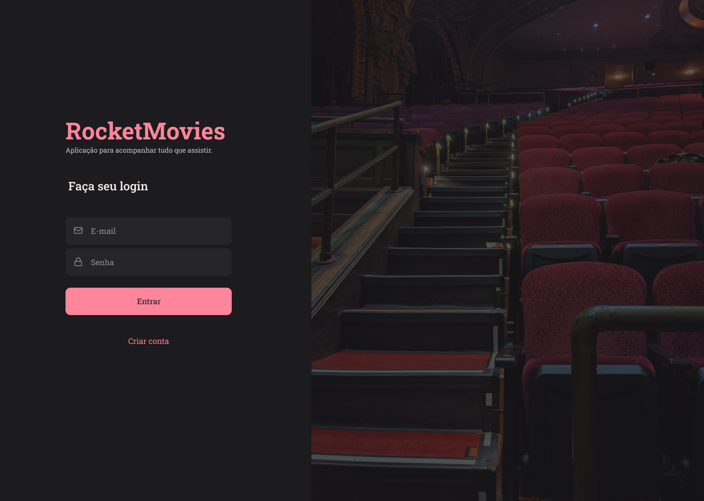
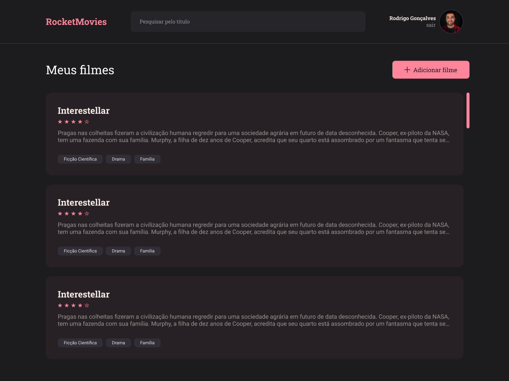
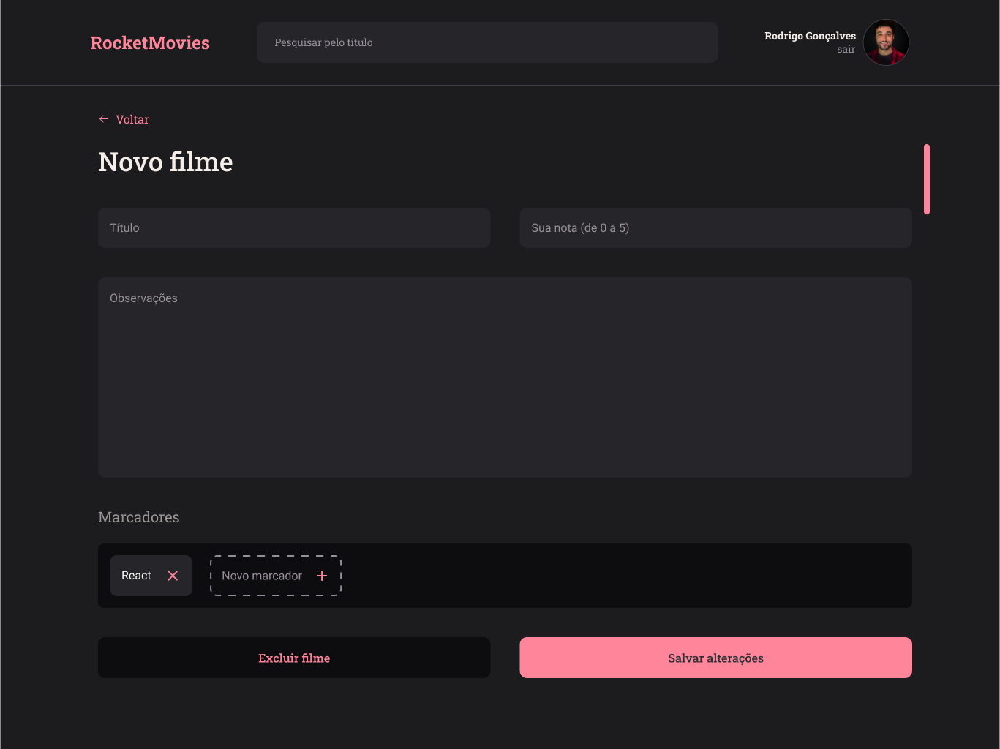
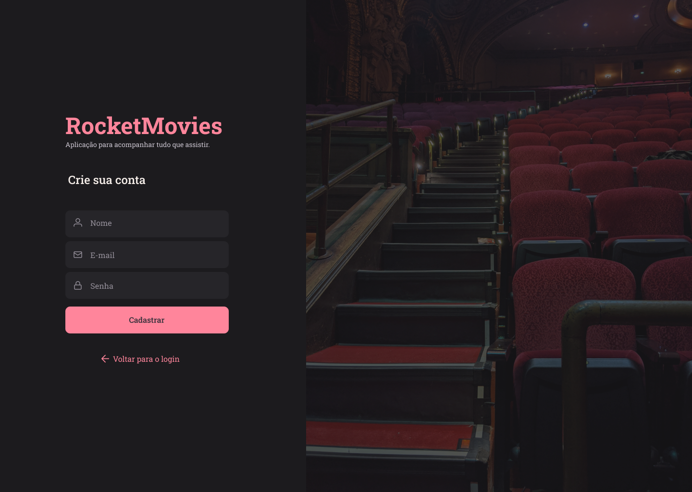
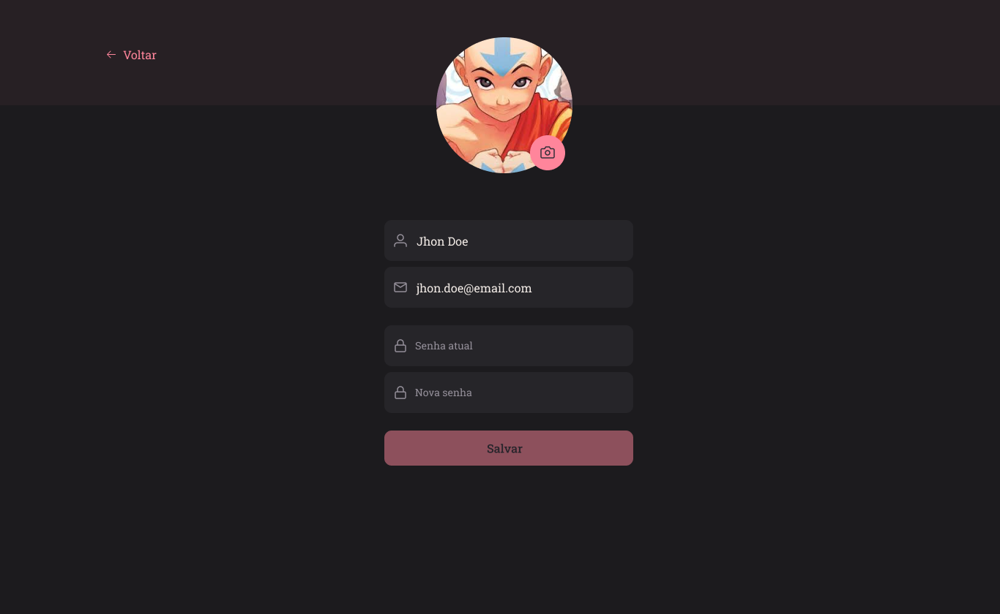
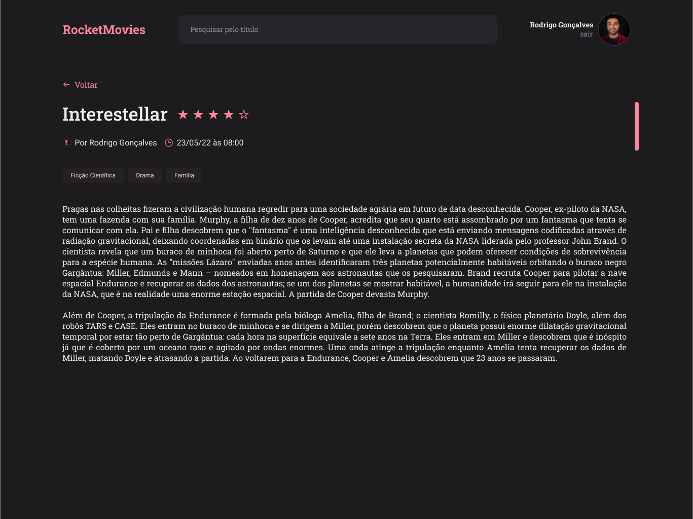

#  Explorer - Projeto 01 

 

###  _**O que desenvolvemos neste Projeto?**_
### **RocketMovies Web - Projeto Frontend**
📌 RocketMovies é uma Aplicação para gerenciar anotações sobre filmes e séries. O usuário poderá cadastrar notas, atribuir ranking para cada filme com tags vinculados a nota. O usuário poderá fazer buscas de notas cadastradas, bem como lista-las. Cada usuário terá seu próprio perfil e também poderá atualiza-lo. 

 

# :book: Aprendizados
* _**Criando uma aplicação React.js**_
- [x]  O que é ReactJS;
- [x]  Utilização do Vite;
- [x]  Estruturar pastas e arquivos no ReactJS;
- [x]  Executar um projeto ReactJS;
- [x]  Fragment;
- [x]  styled-components;
- [x]  Adicionar fontes personalizadas;
- [x]  Components;
- [x]  Props;
- [x]  Rotas;
- [x]  Navegação;

## ♻️ Environment init

- Clonando o repositório
  **$ git clone**

- Instalando node_modules
  **$ npm install**

- Inicializando projeto modo Desenvolvimento
  **$ npm run dev**

## 📚 Stack utilizada

## Screenshots

